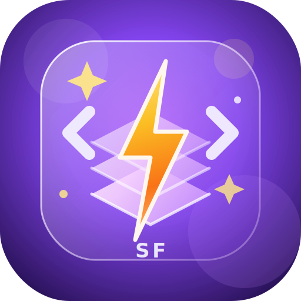

# ⚡ StackForge

<p align="center">
  
</p>

<h3 align="center">
  IDE visual, moderno e interactivo para programar en Forth
</h3>

<p align="center">
  <strong>Visualizá la pila. Ejecutá código. Analizá cada paso.</strong>
</p>

<p align="center">
  <a href="https://www.zernyxtechstudio.xyz/">
    
  </a>
  
  
  
</p>

<p align="center">
  
  
  
  
  
</p>

---

## 📌 Descripción

**StackForge** es un IDE visual, moderno e interactivo para programar en **Forth**, desarrollado por **Matías Isaac Frutos Gonzales** para **ZERNYX Tech Studio**.

El proyecto transforma la experiencia clásica de Forth —normalmente asociada a terminales simples— en una herramienta visual, educativa y moderna, donde el usuario puede escribir código y ver en tiempo real cómo se mueve la pila de datos.

> StackForge permite ver lo que normalmente queda oculto dentro del intérprete.

---

## 🎯 Propósito

El objetivo de StackForge es crear una herramienta clara, visual y accesible para aprender, probar y enseñar programación en Forth.

Mientras el usuario escribe código, puede ver:

- 📥 Qué valores entran a la pila.
- 📤 Qué valores salen de la pila.
- ⚙️ Qué operación se está ejecutando.
- 🧠 Cómo cambia el estado interno del programa.
- 📚 Qué palabras están disponibles en el diccionario.
- 🧬 Qué tan complejo o riesgoso es el código mediante Stack DNA.
- 🎬 Cómo se ejecuta cada token mediante Stack Replay.

---

## 🚀 Propuesta de valor

StackForge no busca ser otro editor más.

Su diferencial está en que permite visualizar el estado interno del lenguaje mientras el código se ejecuta.

Esto lo convierte en una herramienta ideal para:

- 🎓 Estudiantes.
- 👨‍🏫 Docentes.
- 👨‍💻 Programadores técnicos.
- 🔌 Desarrolladores de sistemas embebidos.
- 🧪 Makers e IoT.
- 🧠 Entusiastas de lenguajes stack-based.
- 🏗️ Personas que quieren entender programación desde la lógica interna.

---

## ✨ Funcionalidades principales

| Módulo | Descripción |
|---|---|
| 📝 Editor de código | Permite escribir programas Forth desde una interfaz moderna. |
| ⚙️ Intérprete Forth | Ejecuta código Forth mediante JavaScript puro. |
| 📦 Stack Visualizer | Muestra la pila de datos en tiempo real. |
| 📚 Diccionario | Lista las palabras disponibles del lenguaje. |
| 💬 REPL integrado | Permite probar comandos rápidos sin modificar el editor principal. |
| 🎬 Stack Replay | Reconstruye la ejecución paso a paso, token por token. |
| 🧬 Stack DNA | Analiza el código y genera métricas operativas. |
| 🖥️ Desktop App | Preparado para compilar como EXE con Electron. |

---

## 🧪 Ejemplo rápido

Código Forth:

```forth
2 3 + 4 *
